<a href="./README.md"><strong>English</strong></a>
&nbsp;&nbsp;·&nbsp;&nbsp;
<a href="./README.fa.md">فارسی</a>

 
 

## Hi — I’m Mohsen.

I like the moment when an idea stops being a conversation and starts becoming something people can actually use.

I’m a vibe coder focused on **prompt engineering, AI-assisted development, automation, and agents**. I use AI as a hands-on building environment: to explore an idea, question it, prototype it, connect it to tools, and keep improving it until it solves the actual problem.

### What I actually do

- **Build with AI** — turn rough ideas into working prototypes and products.
- **Design prompt systems** — create clear, reusable instructions instead of relying on one lucky prompt.
- **Automate work** — connect tools, APIs, and workflows so repetitive tasks stop needing attention.
- **Work with agents** — give models the context, tools, and boundaries they need to complete useful work.

### How I tend to work

I start with the messy version of an idea. Then I make it smaller, clearer, and testable. I build the first useful version, see where it fails, and automate whatever keeps repeating.

<code>rough idea → useful version → real feedback → better system</code>

It is less dramatic than the usual AI pitch, but it gets things made.

### Tools I reach for

| Area | Tools and methods |
|:--|:--|
| **AI** | OpenAI, LangChain, prompt engineering, AI agents |
| **Automation** | n8n, APIs, webhooks |
| **Product** | JavaScript, TypeScript, React, Node.js |
| **Shipping** | Git, Docker |

### A note on AI

> AI can produce code. The useful part is knowing what to ask for, what to reject, and what is worth building in the first place.

That judgment is the part I care about most.

---

If you are building something **strange, useful, or both**, I’d like to hear about it.

 
 

<a href="https://mohsenix.lovable.app/"><strong>Portfolio</strong></a>
&nbsp;&nbsp;·&nbsp;&nbsp;
<a href="mailto:mohsenid0@gmail.com"><strong>Email</strong></a>
&nbsp;&nbsp;·&nbsp;&nbsp;
<a href="https://github.com/mohsenix-code"><strong>GitHub</strong></a>

 
 

Mohsen Afsharpour · mohsenix-code

